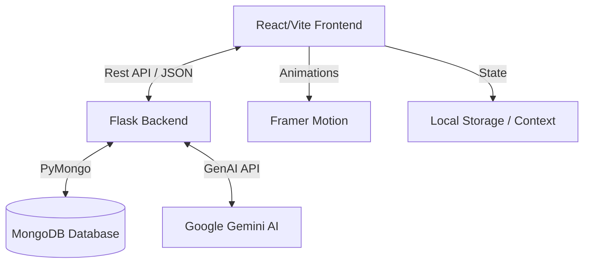

# 🚀 Product Hunt: Digital Module Registry

An elite, full-stack digital product discovery platform engineered with a high-performance **React/Vite** frontend and a robust **Flask/MongoDB** backend. This platform features cinematic transitions, glassmorphic UI elements, and a dedicated **Gemini AI** integration for technical product analysis.

---

## ✨ Core Features

### 🛒 Dual-Ecosystem Authentication
- **Consumer Portal**: Specialized interface for browsing, searching, and analyzing public product modules.
- **Seller Dashboard**: Exclusive workstation for creators to broadcast, manage, and monitor their digital assets.
- **Role Isolation**: Strictly segmented routing logic ensures complete data security between user tiers.

### 🤖 AI-Powered "Stack Analysis"
- **Gemini AI Integration**: Leverages Google’s latest LLM models to analyze product features.
- **Competitive Comparison**: Automatically identifies the "Optimal" product choice based on category alignment, technical depth, and price-to-value ratio.
- **Real-time Verification**: Instant technical validation of modules during comparison.

### 🎨 Cinematic UX/UI
- **Framer-Motion Transitions**: Smooth fade-and-pull layout transitions using `<AnimatePresence>`.
- **Glassmorphic Design**: Modern, translucent UI panels with real-time blur and depth effects.
- **Shimmer Mechanics**: Meticulously timed skeleton-loaders that map perfectly to item geometry for a premium feel.
- **Sonner Notifications**: Non-intrusive, sleek toast bridges for network status and error reporting.

### 📂 Dynamic Registry
- **Global Module Feed**: Infinite-scroll style registry of verified software protocols and technological assets.
- **Deep-View Details**: Item-specific expansion views for technical documentation and seller metadata.

---

## 🛠 Tech Stack

### Frontend Architecture
| Technology | Description |
| :--- | :--- |
| **React 19** | Core library for dynamic component architecture. |
| **Vite 8** | Next-generation frontend tooling for ultra-fast HMR. |
| **Framer Motion** | Industry-standard animation engine for cinematic transitions. |
| **React Router 7** | Sophisticated client-side routing and layout management. |
| **Lucide React** | Premium icon suite for consistent visual language. |
| **Sonner** | Modern, high-performance toast notification system. |

### Backend Logic
| Technology | Description |
| :--- | :--- |
| **Python / Flask** | Lightweight and performant REST API framework. |
| **Flask-PyMongo** | Official bridge for schema-less MongoDB document parsing. |
| **Google Gemini API** | Advanced AI engine for product analysis and recommendations. |
| **Werkzeug Security** | Enterprise-grade password hashing and credential protection. |

### Database
| Technology | Description |
| :--- | :--- |
| **MongoDB** | NoSQL database for rapid nesting of complex product schemas. |

---

## 🏛 System Architecture



---

## 🚀 Getting Started

### 1. Repository Preparation
Clone the repository and install dependencies for both layers.

```bash
# Clone
git clone https://github.com/your-repo/product-hunt.git
cd product-hunt
```

### 2. Database & Environment Setup
Extract the database binaries or connect to a cloud instance.

1.  **MongoDB**: Ensure [MongoDB Community Server](https://www.mongodb.com/try/download/community) is running locally.
2.  **Environment**: Create a `.env` file in the `/backend` directory.
    ```env
    MONGO_URI="mongodb://localhost:27017/product_hunt"
    GEMINI_API_KEY="your_api_key_here"
    ```

### 3. Ignition Sequence

**Terminal 1: Backend (Flask)**
```bash
cd backend
pip install -r requirements.txt
python app.py
```

**Terminal 2: Frontend (Vite)**
```bash
cd frontend
npm install
npm run dev
```

---

## 📂 Project Structure

```text
├── backend/
│   ├── app.py           # Flask Entry Point & AI Logic
│   ├── requirements.txt # Python Dependencies
│   └── .env             # Configuration
├── frontend/
│   ├── src/
│   │   ├── components/  # Atomic UI Components
│   │   ├── pages/       # Layout Views (Home, Dashboard, etc.)
│   │   └── App.jsx      # Router & Animation Config
│   ├── package.json     # Node Dependencies
│   └── vite.config.js   # Vite Orchestration
└── README.md            # You are here
```

---

## 📄 License
Custom built for the Product Hunt Ecosystem. Built with passion by Ryder.
